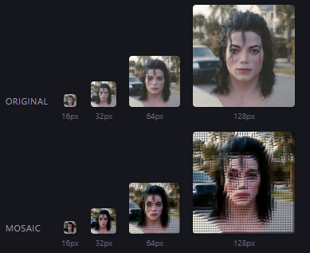

# 🧩 Portraits

Turn a photo into a pixel-art avatar that still looks like *you*, even when an app shrinks it down to a tiny profile picture.

<p align="center">
  
</p>

<p align="center">
  <em>Each photo and its mosaic at 16, 32, 64, and 128px. The grid is tuned for <strong>64px</strong>, the size most apps display, so the face stays clearest right where it counts.</em>
</p>

**[▶ Try it live](https://portraits.i0.tf)**

Everything runs inside your browser tab. No server, no sign-up, no uploads. Your photo never leaves your computer.

---

## Why use it

🎨 &nbsp;**An avatar, not a photo you lose control of.** You upload a mosaic of your face instead of the real thing, so the sharpest copy anyone can ever pull is the mosaic you made. Your actual photo never leaves your computer.

🔍 &nbsp;**Survives tiny sizes.** Discord, Slack, and GitHub squash your avatar down to 32 or 64 pixels wide, where a normal photo turns into a blurry smudge. Portraits works the other way around: you tell it how small the picture will be shown, and it builds a mosaic coarse enough to still read clearly once it's shrunk.

🎯 &nbsp;**A tiny avatar isn't really private.** On most platforms any user can fetch the full-resolution original you uploaded, so a small, blurry-looking avatar only *looks* private — the sharp photo is one request away. The fix is to never upload the real photo in the first place.

🔒 &nbsp;**Nothing leaves your browser.** All the work happens locally, so your original photo is never sent anywhere. Nobody — not us, not any cloud service — ever sees it.

🛡️ &nbsp;**Measure it, don't guess.** Turn on any of the optional Privacy tools and Portraits runs real open-source face-detection and face-recognition models **locally in your browser** — nothing is uploaded — to score how well the mosaic still matches your original. Then it hands you the levers to push that score down: mask the eyes, subtly warp the face geometry, or optimize an adversarial cloak against the model until a recognizer loses you. You watch the number move.

**What it can and can't do.** Portraits keeps your real photo off the internet and gives you an avatar that still reads as *you* to people who know you, plus an honest, measured readout of how matchable it is. It is still **not** a guarantee against every face-recognition system: a score is only as good as the model behind it, and the more you degrade the picture the less it looks like you. Portraits gives you the dial and the measurement — where you set it is up to you.

## How it works

Upload a photo, position your face, pick a style, and download the result. Behind the scenes it rebuilds the photo as a grid of colored blocks (a mosaic), tuned so the face still comes through at the size you'll actually use.

Most tools make an avatar and *hope* it survives being resized. Portraits works the problem backwards: it starts from the final display size and picks a block grid that's guaranteed to hold up.

## Features

- 📐 &nbsp;**Size-aware grid.** Tell it where the avatar will live ("64px in Discord") and it picks the right level of chunkiness automatically.
- 🎨 &nbsp;**Five looks.** Solid square blocks, dotted halftone, raised 3D relief, ASCII characters, or a four-color CMYK print screen.
- 🌗 &nbsp;**Color or black-and-white**, with brightness and contrast controls plus one-click auto-enhance.
- 🕹️ &nbsp;**Retro palettes.** 1-bit, grayscale, Game Boy, and Minecraft, or bring your own colors. (Uses Floyd–Steinberg dithering to fake more colors than you actually have.)
- ✂️ &nbsp;**Framing.** Crop to a square or circle, add a round mask, and pick a transparent or solid background.
- 💾 &nbsp;**Presets.** Save a look you like, name it, and share it with others as a small file.
- ⬇️ &nbsp;**Real downloads.** Export a PNG at 512, 1024, 2048, or 4096 pixels; a crisp SVG vector for square, dot, and ASCII styles; or a three-size PNG ZIP.
- 🛡️ &nbsp;**Privacy tools (optional).** Mask the eyes, subtly warp the face geometry, or automatically optimize an experimental adversarial cloak — and Portraits measures how well face recognition can still match your avatar, entirely on your machine, so you can dial it down. The ~7 MB model preloads locally in the background after the page opens.

---

*The rest of this README is for developers who want to run, tinker with, or deploy the project.*

## 🔢 How the grid math works

Two lines do the important part:

```ts
gridSize  = clamp(round(displaySizePx / targetBlockScreenPx), 12, 128)
blockSize = outputSizePx / gridSize
```

Say the avatar will be shown at **64px** and you want each block to read as roughly **2px** on screen. That gives `64 / 2 = 32` blocks across. Export at **1024px** and each block becomes `1024 / 32 = 32px`. The result is a 1024×1024 image built from a crisp 32×32 mosaic.

## 🛠️ Running it locally

```bash
npm install
npm run dev        # http://localhost:5173
npm run build      # type-check + production build into dist/
npm run preview    # serve the production build
npm run typecheck
npm run lint
npm run test:e2e   # Playwright against your local Chrome (no browser download)
```

### Tech

- Vite, React 19, and TypeScript
- Zustand for state
- Canvas 2D for interactive previews, with OffscreenCanvas Web Worker exports
- Plain CSS with design tokens, no runtime UI dependencies
- Optional face analysis via [face-api.js](https://github.com/vladmandic/face-api) (MIT), dynamically imported after initial load so the base bundle stays small; its ~7 MB of models preload from the same origin and are never uploaded (the CSP forbids external calls)

The image engine lives in [`src/core/`](src/core/) as pure, framework-agnostic functions, so it runs on the main thread or inside a worker and stays easy to unit-test on its own.

### End-to-end tests

[`e2e/`](e2e/) drives the app in real Chrome through Playwright's `channel: "chrome"`, so nothing gets downloaded. A dependency-free PNG encoder ([`e2e/fixtures/makeImage.ts`](e2e/fixtures/makeImage.ts)) generates a deterministic test face, and the specs walk the full flow (upload, render, mode switch, grayscale, crop, PNG export) by reading actual canvas pixels.

## 🚀 Deploying

The site ships as a Cloudflare Worker using Static Assets, so there's no server code to run. The included [`wrangler.jsonc`](wrangler.jsonc) points a Worker at `dist/`, handles SPA routing, and applies the strict CSP and privacy headers from [`public/_headers`](public/_headers) (no external calls are permitted).

**One click:** clones the repo into your own account, builds, deploys, and sets up push-to-deploy.

[](https://deploy.workers.cloudflare.com/?url=https://github.com/metal0/portraits)

When prompted, set the build command to `npm run build` (a static-assets Worker has no entry point for Cloudflare to infer it from); everything else is read from `wrangler.jsonc`.

**Git integration:** in the Cloudflare dashboard, go to Workers & Pages, create a Worker by importing the repo, and set the build command to `npm run build` and the deploy command to `npx wrangler deploy`. Cloudflare reads `wrangler.jsonc` for the rest, and every push to `main` triggers a build and deploy.

**Wrangler CLI:**

```bash
npm run build
npx wrangler deploy
```

## License

MIT
